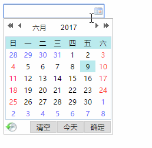
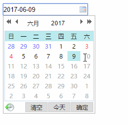

<Excerpt in index | 首页摘要> 
My97 DatePicker 也称作WdatePicker,一款开源的，功能强大的日期控件。
官网：http://www.my97.net/dp/index.asp
<!-- more -->
<The rest of contents | 余下全文>

-----
#### 1.介绍
My97 DatePicker 也称作WdatePicker,一款开源的，功能强大的日期控件。
官网：http://www.my97.net/dp/index.asp

基本功能演示：


#### 2.使用方法
下载地址：http://www.my97.net/dp/down.asp

在官网下载的文件，目录结构不要动，（具体的规则看下载包里面的文件提示）。只需要在你的项目里面引入：
```javascript
<script src="My97DatePicker/WdatePicker.js"></script>
```
完整的一个基础示例：
```html
<!DOCTYPE html>
<html lang="en">
<head>
	<meta charset="UTF-8">
	<script src="My97DatePicker/WdatePicker.js"></script>
	<title>基本使用</title>
</head>
<body>
	<input class="Wdate" type="text" onClick="WdatePicker()">
</body>
</html>
```

项目开发中经常用到的一些场景
----
#### 3.限制用户只能选择今天以前的时间

```html
<input class="Wdate" type="text" onClick="WdatePicker({maxDate:'%y-%M-#{%d}'})">
```

#### 4.两个输入框，单击最近一周按钮，实现两个输入框时间正好是今天往前推一周（第一个往前推七天，第二个往前推一天）

在做这个例子的时候，日期为2017.6.9
```html
<!DOCTYPE html>
<html lang="en">
<head>
	<meta charset="UTF-8">
	<script src="https://cdn.bootcss.com/jquery/1.10.2/jquery.js"></script>
	<script src="My97DatePicker/WdatePicker.js"></script>
	<title></title>
</head>
<body>
	日期范围:
	<input type="text"  id="LstartTime" class="Wdate" style="width:120px;">
	-
	<input type="text"  id="LendTime" class="Wdate" style="width:120px;">
	<button name="" id="recentWeek" type="submit">最近一周</button>
</body>
<script type="text/javascript">
	$(function () {
	    //获取当前的日期和时间
	    var ndate = new Date();
	    $('#recentWeek').click(function () {
	    	//七天以前
	        $('#LstartTime').val(addDate(ndate, -7));
	        //一天以前
	        $('#LendTime').val(addDate(ndate, -1));
	    });
	});
	function addDate(datetimes, days) {
		//返回从 1970 年 1 月 1 日至今的毫秒数
	    var datetime = new Date(datetimes);
	    //格式化时间戳
	    datetime = datetime.valueOf();
	    //将时间修改为days天以后
	    datetime = datetime + days * 24 * 60 * 60 * 1000;
	    //将时间戳在设置回正确时间格式
	    datetime = new Date(datetime);
	    //返回年月日
	    return datetime.getFullYear() + '-' + (datetime.getMonth() + 1) + '-' + datetime.getDate();
	}
</script>
</html>

```

#### 5.两个输入框，单击最近一月按钮，实现两个输入框时间正好是今天往前推一月（第一个往前推七天，第二个往前推一天）
试验的时间为2017.6.9

```html
<!DOCTYPE html>
<html lang="en">
<head>
	<meta charset="UTF-8">
	<script src="https://cdn.bootcss.com/jquery/1.10.2/jquery.js"></script>
	<script src="My97DatePicker/WdatePicker.js"></script>
	<title></title>
</head>
<body>
	日期范围:
	<input type="text"  id="recentMonthStartTime" class="Wdate" style="width:120px;">
	-
	<input type="text"  id="recentMonthEndTime" class="Wdate" style="width:120px;">
	<button name="" id="recentMonth" type="submit">最近一月</button>
<script type="text/javascript">
	//获取当前时间
	var ndate = new Date();
	$('#recentMonth').click(function () {
	    $('#recentMonthStartTime').val(addMon(-1));
	    $('#recentMonthEndTime').val(addDate(ndate, -1));
	});
	function addDate(datetimes, days) {
	    var datetime = new Date(datetimes);
	    datetime = datetime.valueOf();
	    datetime = datetime + days * 24 * 60 * 60 * 1000;
	    datetime = new Date(datetime);
	    return datetime.getFullYear() + '-' + (datetime.getMonth() + 1) + '-' + datetime.getDate();
	}
	function addMon(mon) {
		//获取当前时间
	    var datetime = new Date();
	    //分两步：1.将获取到的当前时间里面的月份+上传进来的参数mon,然后重新设置原来的时间月份为最新的和这个
	    datetime.setMonth(datetime.getMonth() + mon);
	    return datetime.getFullYear() + '-' + (datetime.getMonth() + 1) + '-' + datetime.getDate();
	}
</script>
</html>
```

#### 6.第一个输入框时间不能超过第二个-第二个输入框时间不能早于第一个
查看：http://www.my97.net/dp/demo/index.htm （脚本自定义限制）
具体的效果
- 第一个输入框的时间范围：最小为第二个输入框的时间往前推(-)30天;最大为第二个输入框的时间
- 第二个输入框的时间范围：最小为第一个输入框的时间；最大为第一个输入框的时间往后推(+)30天


具体代码如下
```html
<!DOCTYPE html>
<html lang="en">
<head>
	<meta charset="UTF-8">
	<script src="https://cdn.bootcss.com/jquery/1.10.2/jquery.js"></script>
	<script src="My97DatePicker/WdatePicker.js"></script>
	<title></title>
</head>
<body>
	<h3>第一个输入框的时间范围：最小~第二个输入框的时间往前推(-)30天;最大~第二个输入框的时间</h3>
	<h3>第二个输入框的时间范围：最小~第一个输入框的时间；最大~第一个输入框的时间往后推(+)30天</h3>
	日期范围:
	<input type="text" onfocus="startTimefocus('LendTime')" id="LstartTime" class="Wdate" style="width:120px;">
	-
	<input type="text" onfocus="endTimefocus('LstartTime')" id="LendTime" class="Wdate" style="width:120px;">
<script type="text/javascript">
	function startTimefocus(endTime) {
	    return WdatePicker({
	        skin: 'whyGreen',
	        //参数endTime是某个input的ID值，此时为LendTime的，也就是第二个input输入框的
	        //最小输入时间为ID=LendTime的输入框时间往前减30天
	        minDate: '#F{$dp.$D(\'' + endTime + '\',{d:-30});}',
	        //最大输入时间为ID=LendTime的输入时间
	        maxDate: '#F{$dp.$D(\'' + endTime + '\')||\'%y-%M-%d\'}',
	        doubleCalendar: true,
	        dateFmt: 'yyyy-MM-dd'
	    });
	}
	function endTimefocus(startTime) {
	    return WdatePicker({
	        skin: 'whyGreen',
	        //参数startTime是某个input的ID值，此时为LstartTime的，也就是第一个input输入框的
	        //最小输入时间为ID=LstartTime的输入框输入的时间
	        minDate: '#F{$dp.$D(\'' + startTime + '\')}',
	        //最大输入时间为ID=LstartTime的输入框时间往后加30天
	        maxDate: '#F{$dp.$D(\'' + startTime + '\',{d:30})||\'%y-%M-%d\'}',
	        doubleCalendar: true,
	        dateFmt: 'yyyy-MM-dd'
	    });
	}
</script>
</html>
```