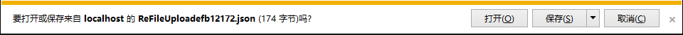
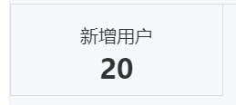

<Excerpt in index | 首页摘要> 
前端开发过程中的bug以及兼容性记录（一）
<!-- more -->
<The rest of contents | 余下全文>

-----
源码：https://github.com/Gabrielkaliboy/demo/tree/master/_posts/bugCompatibility-1
### 1.IE浏览器文件上传返回的json会提示你下载
如图


解决方式：
根据不同的后台语言进行搜索搜索，关键字
- IE 文件上传返回json
- .net上传返回json

修改一下后台返回的数据类型就可以,将后台返回的json模式修改一下，这个问题里面实在.net的json返回的代码里面强制声明了一下，将json改为了字符串格式，`text/html`

放段代码
```.net
if (reboo > 0)
{
    return Json(new
    {
        error = "",
        operateType = "save",
        dealSuccessFlag = true
    }, "text/html");
}
```


### 2. 360安全浏览器在默认安装打开情况下使用IE7的文档模式导致页面布局乱套问题
百度搜索：360安全浏览器默认IE7

#### 2.1 问题描述
页面在Chrome以及IE9/10/11都没有问题，结果在360安全浏览器下打开以后页面布局乱套了，打开控制台发现，360安全浏览器的默认文档模式是IE7。就是这个根本原因导致我好好的页面错乱！

#### 2.2解决
查了很多资料，最后只有这个起效了。将下面这句话放在header的第一个位置，切记是第一位置,简单粗暴

```html
<meta http-equiv="X-UA-Compatible" content="IE=Edge,chrome=1">
```
我的代码结构
```html
<head>
    <meta http-equiv="X-UA-Compatible" content="IE=Edge,chrome=1">
    <meta charset="UTF-8">
    <title>登录(Login)</title>
    <meta name="viewport" content="width=device-width, initial-scale=1.0">
    <meta name="description" http-equiv="Cache-Control" content="no-cache,must-revalidate">
    <meta name="author" content="0">
    <link rel="stylesheet" href="~/Content/Css/base.css">
    <link rel="stylesheet" href="~/Content/Css/login/style.css">
    <script src="~/Scripts/jquery-1.10.2.js"></script>
    <script type="text/javascript" src="~/Scripts/JS/logIn/scripts.js" charset="utf-8"></script>
</head>
```
**补充**为什么简单粗暴？
- 1.根据官网定义X-UA-compatible 标头不区分大小写；不过，它必须显示在网页中除 title 元素和其他 meta 元素以外的所有其他元素之前。如果不是的话，它不起作用。这么啰嗦，我为了简单，直接放在了header的第一个位置，亲测，可行
- 2.content的内容是IE=8，或者IE=edge等值，注意不是IE8或者直接写个edge的值，否则不起作用。


#### 2.3直接让360安全浏览器以默认极速模式打开
```html
<meta name="renderer" content="webkit"/> ,这样闭合标签
```
**问题**
如果你在加meta标签之前已经用360浏览器打开过你的网站了，360会用上一次使用的内核来渲染，也就是说浏览器记忆的渲染内核优先级要高于meta标签，清空下设置缓存什么的再试下，或者开个隐私窗口试下。

#### 2.4 别人的网站用这个也可以

```html
<meta name="renderer" content="webkit|ie-comp|ie-stand">  
```
#### 2.5知识补充
[meta name renderer content webkit无效](https://www.google.co.jp/search?q=meta+name+renderer+content+webkit%E6%97%A0%E6%95%88&sa=X&ved=0ahUKEwiTzLuawMbVAhUHfrwKHWTkDJYQ1QIIZygA&biw=1920&bih=988)

[360 meta](https://www.baidu.com/baidu?tn=null&ie=utf-8&wd=360%20meta)

[360 meta 谷歌](https://www.google.co.jp/search?biw=1920&bih=988&q=360+meta&oq=360+meta&gs_l=psy-ab.3..0l3j0i30k1.1069941.1072169.0.1073562.8.8.0.0.0.0.220.799.0j4j1.5.0....0...1.1.64.psy-ab..3.5.798...0i12k1.fJvdug6rdIQ)
**关于360浏览器**
360有极速版和安全浏览器，二者都是双核模式（IE的trident和谷歌的webkit）。极速模式默认优先使用Chrome打开页面，只有在银行系统下才会自动切换到IE模式；安全浏览器下载安装以后默认打开是IE兼容模式，也就是我们上面写的IE7兼容模式，很恶心，他还可以在地址栏那里手动切换回极速模式（Chrome）

**参考**
360浏览器内核控制Meta标签说明文档：http://se.360.cn/v6/help/meta.html
360安全浏览器 7.1的遇到的模式切换问题：http://www.binjs.com/archives/1015
Stack Overflow：http://stackoverflow.com/questions/6771258/whats-the-difference-if-meta-http-equiv-x-ua-compatible-content-ie-edge-e


### 3.toFixed在保留小数的同时将类型也变了
本来数据是number类型，经过toFixed以后，变为了string类型，这个有点坑
```javascript
//toFixed
//将一个数值转成字符串，并进行四舍五入，保留指定位数的小数

var num = 11.1234;
var newString = num.toFixed(2);
document.write("type: " + typeof (newString));
document.write(newString);
```

### 4.模拟点击a标签触发页面跳转
有的时候我们想给a标签添加一个点击事件，让他根据其属性href进行跳转
```javascript
<a id="alink" href="1.html" style="visibility: hidden;">下一步</a> 
$("#alink").click(); // 触发了a标签的点击事件，但是没有触发页面跳转 
document.getElementById("alink").click(); //既触发了a标签的点击事件，又触发了页面跳转 
```
如果我们不想使用第二种方法.
把 “下一步” 改为 “<span id="spanId">下一步</span>” 即给A标签中的文字添加一个能被jQuery捕获的元素，然后$("#spanId").click()；，才可以触发页面跳转。


### 5.png图片在Chrome、IE、Firefox、ps中颜色不一致问题
问题描述：公司做了一个logo，结果在ps中是A颜色，IE与ps一样都是A颜色，但是放在Firefox和Chrome中颜色就不一致了。原因在于，png图片保存的时候有一个ICC配置文件，如果勾选这个选项，就会导致这个问题。

关于这个问题的讨论：https://bugs.chromium.org/p/chromium/issues/detail?id=44872
解决方法：不勾选或者直接保存为web所用格式！

### 6.同时使用hover和after/before伪类
有时候有这样的需求，当鼠标划上的时候，显示一个三角

重点：**.applyItemsTabItem:hover::after**后面是两个冒号的after，记得在.applyItemsTabItem里面设置相对定位`position:relative`


```css
.applyItemsTabItem {
    width: 14.285%;
    position:relative;
    float: left;
    text-align: center;
    height: 100px;
    border-bottom: 1px solid #e2d9d9;
    border-left: 1px solid #e2d9d9;
    border-right: 1px solid #e2d9d9;
}
.applyItemsTabItem:hover {
    border-bottom: 3px solid #1D82D2;
}
.applyItemsTabItem:hover::after {
border-bottom:3px solid #1D82D2;
content: '';
position: absolute;
top: 100%;
left: 42%;
width: 0;
height: 0;
border-width: 11px;
border-style: solid;
border-color: transparent;
margin-bottom: 1px;
border-top-color: currentColor;
color: #1D82D2;
}
```

### 7.关于点击按钮显示div,然后点击页面其他区域隐藏div的实现
首先可以给 document 对象绑定 click 事件。
然后由于事件冒泡机制，你单击文档的任意地方（包括绿色区域）都会触发 click 事件。

先在事件里写上隐藏div区域的代码
然后，再给div区域绑定click事件，这时候阻止事件冒泡，这样一来，点击div区域的话，是不会隐藏掉自己的。
```html
<!DOCTYPE html>
<html lang="en">
<head>
	<meta charset="UTF-8">
	<script src="https://cdn.bootcss.com/jquery/3.0.0/jquery.min.js"></script>
	<style>
		#div1{
			display: none;
		}
	</style>
	<title>Document</title>
</head>
<body>
	<button id="btn">点我显示</button>
	<div id="div1">哈哈哈</div>
</body>
<script>
$(function(){
	$("#btn").on("click",function(e){
		e.stopPropagation();
		$("#div1").css("display","block");
	});
	$(document).on("click",function(e){
		$("#div1").css("display","none");
	});
})
</script>
</html>
```

### 8.meta 标签