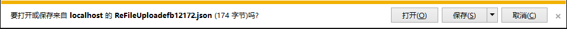

<Excerpt in index | 首页摘要> 
前端开发过程中的bug以及兼容性记录（一）
<!-- more -->
<The rest of contents | 余下全文>

-----

#### 1.IE浏览器文件上传返回的json会提示你下载
如图


解决方式：
根据不同的后台语言进行搜索搜索，关键字
- IE 文件上传返回json
- .net上传返回json

修改一下后台返回的数据类型就可以,将后台返回的json模式修改一下，这个问题里面实在.net的json返回的代码里面强制声明了一下，将json改为了字符串格式，`text/html`

放段代码
```.net
if (reboo > 0)
{
    return Json(new
    {
        error = "",
        operateType = "save",
        dealSuccessFlag = true
    }, "text/html");
}
```


#### 2. 360安全浏览器在默认安装打开情况下使用IE7的文档模式导致页面布局乱套问题
百度搜索：360安全浏览器默认IE7

##### 2.1 问题描述
页面在Chrome以及IE9/10/11都没有问题，结果在360安全浏览器下打开以后页面布局乱套了，打开控制台发现，360安全浏览器的默认文档模式是IE7。就是这个根本原因导致我好好的页面错乱！

##### 2.2解决
查了很多资料，最后只有这个起效了。将下面这句话放在header的第一个位置，切记是第一位置,简单粗暴

```html
<meta http-equiv="X-UA-Compatible" content="IE=Edge,chrome=1">
```
我的代码结构
```html
<head>
    <meta http-equiv="X-UA-Compatible" content="IE=Edge,chrome=1">
    <meta charset="UTF-8">
    <title>登录(Login)</title>
    <meta name="viewport" content="width=device-width, initial-scale=1.0">
    <meta name="description" http-equiv="Cache-Control" content="no-cache,must-revalidate">
    <meta name="author" content="0">
    <link rel="stylesheet" href="~/Content/Css/base.css">
    <link rel="stylesheet" href="~/Content/Css/login/style.css">
    <script src="~/Scripts/jquery-1.10.2.js"></script>
    <script type="text/javascript" src="~/Scripts/JS/logIn/scripts.js" charset="utf-8"></script>
</head>
```
**补充**为什么简单粗暴？
- 1.根据官网定义X-UA-compatible 标头不区分大小写；不过，它必须显示在网页中除 title 元素和其他 meta 元素以外的所有其他元素之前。如果不是的话，它不起作用。这么啰嗦，我为了简单，直接放在了header的第一个位置，亲测，可行
- 2.content的内容是IE=8，或者IE=edge等值，注意不是IE8或者直接写个edge的值，否则不起作用。

有人说这个也可以解决，以后可以测试一下
```html
<meta name="renderer" content="webkit|ie-comp|ie-stand">  
```
亲测上面的meta可用，他是在360安全浏览器渲染的时候直接使用chrome模式，但是如果刻意的调到IE兼容，还会乱。第一个方法，不论用户使用哪种模式（极速或者兼容），都能够正常显示。所以还是第一个方法好一些。为了让浏览器自己打开的时候直接是极速模式，我将第一个meta做了修改

```html
<meta http-equiv="X-UA-Compatible" content="Chrome=1,IE=edge" />
```
将Chrome放在了第一个位置，没效果！！！！！！！！！！
##### 2.3知识补充

**关于360浏览器**
360有极速版和安全浏览器，二者都是双核模式（IE的trident和谷歌的webkit）。极速模式默认优先使用Chrome打开页面，只有在银行系统下才会自动切换到IE模式；安全浏览器下载安装以后默认打开是IE兼容模式，也就是我们上面写的IE7兼容模式，很恶心，他还可以在地址栏那里手动切换回极速模式（Chrome）

**参考**
360浏览器内核控制Meta标签说明文档：http://se.360.cn/v6/help/meta.html
360安全浏览器 7.1的遇到的模式切换问题：http://www.binjs.com/archives/1015
Stack Overflow：http://stackoverflow.com/questions/6771258/whats-the-difference-if-meta-http-equiv-x-ua-compatible-content-ie-edge-e