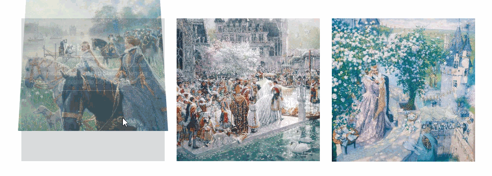

<Excerpt in index | 首页摘要> 
css3特效集合
<!-- more -->
<The rest of contents | 余下全文>

-----
#### 1.这是一款使用CSS3制作的炫酷鼠标滑过图片动画特效。
该特效中，当鼠标滑过图片时，图片会向上3D翻转并渐隐消失，图片原来的位置出现介绍文字和一些链接，整个效果非常炫酷。(gif帧频低，图片效果不是很好)


##### 1.1html结构
该鼠标滑过图片动画效果的HTML结构使用Bootstrap来布局，布局非常简单：
```html
<div class="container">
    <div class="row">
        <div class="col-md-4 col-sm-6">
            <div class="box">
                
                <div class="over-layer">
                    <h3 class="title">Web designer</h3>
                    <p class="description">描述文字...</p>
                    <ul class="social-links">
                        <li><a href="#" class="fa fa-download"></a></li>
                        <li><a href="#" class="fa fa-link"></a></li>
                        <li><a href="#" class="fa fa-search"></a></li>
                    </ul>
                </div>
            </div>
        </div>
    </div>
</div>
```
整个的html
```html
<!DOCTYPE html>
<html lang="en">
<head>
	<link href="https://cdn.bootcss.com/bootstrap/3.3.6/css/bootstrap.min.css" rel="stylesheet">
	<link rel="stylesheet" href="style.css">
	<style type="text/css">
		.mt50 {
		    margin-top: 50px;
		}
	</style>
	<meta charset="UTF-8">
	<title></title>
</head>
<body>
	<div class="container mt50">
	    <div class="row">
	        <div class="col-md-4 col-sm-6">
	            <div class="box">
	                
	                <div class="over-layer">
	                    <h3 class="title">Web designer</h3>
	                    <p class="description">Lorem ipsum dolor sit amet, consectetur adipisicing elit. Adipisci blanditiis tenetur veniam? Ad architecto asperiores blanditiis.</p>
	                    <ul class="social-links">
	                        <li><a href="#" class="fa fa-download"></a></li>
	                        <li><a href="#" class="fa fa-link"></a></li>
	                        <li><a href="#" class="fa fa-search"></a></li>
	                    </ul>
	                </div>
	            </div>
	        </div>
	        <div class="col-md-4 col-sm-6">
	            <div class="box">
	                
	                <div class="over-layer">
	                    <h3 class="title">Web designer</h3>
	                    <p class="description">Lorem ipsum dolor sit amet, consectetur adipisicing elit. Adipisci blanditiis tenetur veniam? Ad architecto asperiores blanditiis.</p>
	                    <ul class="social-links">
	                        <li><a href="#" class="fa fa-download"></a></li>
	                        <li><a href="#" class="fa fa-link"></a></li>
	                        <li><a href="#" class="fa fa-search"></a></li>
	                    </ul>
	                </div>
	            </div>
	        </div>
	        <div class="col-md-4 col-sm-6">
	            <div class="box">
	                
	                <div class="over-layer">
	                    <h3 class="title">Web designer</h3>
	                    <p class="description">Lorem ipsum dolor sit amet, consectetur adipisicing elit. Adipisci blanditiis tenetur veniam? Ad architecto asperiores blanditiis.</p>
	                    <ul class="social-links">
	                        <li><a href="#" class="fa fa-download"></a></li>
	                        <li><a href="#" class="fa fa-link"></a></li>
	                        <li><a href="#" class="fa fa-search"></a></li>
	                    </ul>
	                </div>
	            </div>
	        </div>
	    </div>
	</div>
</body>
</html>
```

##### 1.2css样式

```css
/*一幅图片和它的描述文本都包裹在一个div.box容器中，为容器设置透视效果。*/
.box{
    position: relative;
    perspective: 1000px;
}  
/*图片开始时透明度为1，宽度为100%容器宽度，高度自适应，并设置ease-in-out的动画过渡效果。*/
.box img{
    width: 100%;
    height: auto;
    opacity:1;
    transform: translateY(0) rotateX(0);
    transition: all 0.6s ease-in-out 0s;
}  
/*在鼠标滑过图片的时候，图片沿Y轴移动-100%（即向上移动，移动距离为图片的高度），并沿X轴旋转90度，由于设置了旋转的中心为图片的底部，所以得到的效果为图片向上并翻转的效果。*/
.box:hover img{
    transform: translateY(-100%) rotateX(90deg);
    transform-origin: center bottom 0;
    opacity:0;
} 
/*图片的文字层开始使透明度为0，定位方式使用绝对定位，宽度和高度都为100%容器宽度和高度，同样设置ease-in-out的动画过渡效果。*/
.box .over-layer{
    position: absolute;
    top:0;
    left:0;
    width:100%;
    height:100%;
    opacity:0;
    background:#333d4b;
    text-align:center;
    padding: 0 20px;
    transition: all 0.60s ease-in-out 0s;
}  
  /*在鼠标滑过时，它的透明度被设置为1。*/
.box:hover .over-layer{
    opacity:1;
} 

/*剩下的与这个特效无关了，是设置里面的文字样式的*/
.box .title,
.box .description,
.box .social-links{
    position: relative;
    top: 11%;
    color: #d3d3d3;
}
.box .title{
    text-transform: capitalize;
}
.box .title:after,
.box .description:after{
    content:"";
    width: 50%;
    display: block;
    margin: 10px auto 0;
    border-bottom: 1px solid #fff;
}
.box .social-links{
    padding:0;
    margin:0;
    list-style: none;
}
.box .social-links li{
    margin: 10px;
    display: inline-block;
}
.box .social-links li a{
    color: #fff;
    font-size: 20px;
}
.box .social-links li a:hover{
    color: #d3d3d3;
    text-decoration: none;
}
@media only screen and (max-width: 990px){
    .box{  margin-bottom:20px; }
}

```


#### 2.imagehover.css-纯CSS3鼠标滑过图片效果动画库	
官网：http://imagehover.io/

GitHub：https://github.com/ciar4n/imagehover.css

这个例子说明地址：https://github.com/Gabrielkaliboy/markdown/tree/master/demo/css3SpecialEffects1/2.imagehover


##### 2.1 介绍
imagehover.css是一款纯CSS3鼠标滑过图片效果动画库。它可以适应图片的缩放，提供44种不同的鼠标滑过图片效果，压缩后的版本只有19K大小，可以完成各种不同场景的需求。

##### 2.2 使用
在页面中使用下面的HTML结构，图片的src指向你需要的图片，Hover Content是鼠标滑过时显示的内容，可以自定义。在figure元素中，你可以将class设置为一种你需要的鼠标滑过图片效果的class类。

- 引入css
```css
<link type="text/css" rel="stylesheet" href="css/imagehover.min.css" />               
```

- html结构
```html
<figure class="imghvr-fade">
    
    <figcaption>
        // Hover Content
    </figcaption>
    <a href="#"></a>
</figure>    
```

##### 2.3 imagehover.css可以使用的类
imghvr-fade
imghvr-push-up
imghvr-push-down
imghvr-push-left
imghvr-push-right
imghvr-slide-up
imghvr-slide-down
imghvr-slide-left
imghvr-slide-right
imghvr-reveal-up
imghvr-reveal-down
imghvr-reveal-left
imghvr-reveal-right
imghvr-hinge-up
imghvr-hinge-down
imghvr-hinge-left
imghvr-hinge-right
imghvr-flip-horiz
imghvr-flip-vert
imghvr-flip-diag-1
imghvr-flip-diag-2
imghvr-shutter-out-horiz
imghvr-shutter-out-vert
imghvr-shutter-out-diag-1
imghvr-shutter-out-diag-2
imghvr-shutter-in-horiz
imghvr-shutter-in-vert
imghvr-shutter-in-out-horiz
imghvr-shutter-in-out-vert
imghvr-shutter-in-out-diag-1
imghvr-shutter-in-out-diag-2
imghvr-fold-up
imghvr-fold-down
imghvr-fold-left
imghvr-fold-right
imghvr-zoom-in
imghvr-zoom-out
imghvr-zoom-out-up
imghvr-zoom-out-down
imghvr-zoom-out-left
imghvr-zoom-out-right
imghvr-zoom-out-flip-horiz
imghvr-zoom-out-flip-vert
imghvr-bl

