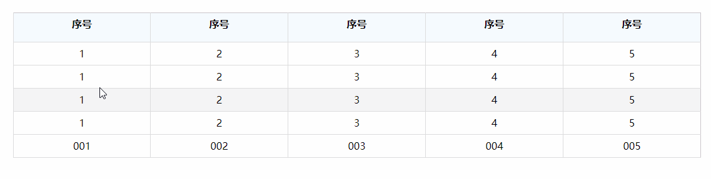

<Excerpt in index | 首页摘要> 
 鼠标拖动改变table列宽
<!-- more -->
<The rest of contents | 余下全文>

-----

#### 1.resizable-tables.js

##### 1.1使用
- 官网：目前没有找到官方文档，只贴一个下载地址吧：http://download.csdn.net/detail/zhangd83/654639
- 可能是官网：http://bz.var.ru/comp/web/resizable.html

- 示例代码：

- 使用方法：
	- 引入resizable-table.js（不用引入任何依赖）
	- 在需要鼠标拖动改变table列宽的table标签上面添加一个resizable类，仅此而已，非常简单

- 还是放一下resizable-table.js的内容吧，没多大
```javascript
//
// Resizable Table Columns.
//  version: 1.0
//
// (c) 2006, bz
//
// 25.12.2006:  first working prototype
// 26.12.2006:  now works in IE as well but not in Opera (Opera is @#$%!)
// 27.12.2006:  changed initialization, now just make class='resizable' in table and load script
//
function preventEvent(e) {
	var ev = e || window.event;
	if (ev.preventDefault) ev.preventDefault();
	else ev.returnValue = false;
	if (ev.stopPropagation)
		ev.stopPropagation();
	return false;
}

function getStyle(x, styleProp) {
	if (x.currentStyle)
		var y = x.currentStyle[styleProp];
	else if (window.getComputedStyle)
		var y = document.defaultView.getComputedStyle(x,null).getPropertyValue(styleProp);
	return y;
}

function getWidth(x) {
	if (x.currentStyle)
		// in IE
		var y = x.clientWidth - parseInt(x.currentStyle["paddingLeft"]) - parseInt(x.currentStyle["paddingRight"]);
		// for IE5: var y = x.offsetWidth;
	else if (window.getComputedStyle)
		// in Gecko
		var y = document.defaultView.getComputedStyle(x,null).getPropertyValue("width");
	return y || 0;
}

function setCookie (name, value, expires, path, domain, secure) {
	document.cookie = name + "=" + escape(value) +
		((expires) ? "; expires=" + expires : "") +
		((path) ? "; path=" + path : "") +
		((domain) ? "; domain=" + domain : "") +
		((secure) ? "; secure" : "");
}

function getCookie(name) {
	var cookie = " " + document.cookie;
	var search = " " + name + "=";
	var setStr = null;
	var offset = 0;
	var end = 0;
	if (cookie.length > 0) {
		offset = cookie.indexOf(search);
		if (offset != -1) {
			offset += search.length;
			end = cookie.indexOf(";", offset)
			if (end == -1) {
				end = cookie.length;
			}
			setStr = unescape(cookie.substring(offset, end));
		}
	}
	return(setStr);
}
// main class prototype
function ColumnResize(table) {
	if (table.tagName != 'TABLE') return;

	this.id = table.id;

	// ============================================================
	// private data
	var self = this;

	var dragColumns  = table.rows[0].cells; // first row columns, used for changing of width
	if (!dragColumns) return; // return if no table exists or no one row exists

	var dragColumnNo; // current dragging column
	var dragX;        // last event X mouse coordinate

	var saveOnmouseup;   // save document onmouseup event handler
	var saveOnmousemove; // save document onmousemove event handler
	var saveBodyCursor;  // save body cursor property

	// ============================================================
	// methods

	// ============================================================
	// do changes columns widths
	// returns true if success and false otherwise
	this.changeColumnWidth = function(no, w) {
		if (!dragColumns) return false;

		if (no < 0) return false;
		if (dragColumns.length < no) return false;

		if (parseInt(dragColumns[no].style.width) <= -w) return false;
		if (dragColumns[no+1] && parseInt(dragColumns[no+1].style.width) <= w) return false;

		dragColumns[no].style.width = parseInt(dragColumns[no].style.width) + w +'px';
		if (dragColumns[no+1])
			dragColumns[no+1].style.width = parseInt(dragColumns[no+1].style.width) - w + 'px';

		return true;
	}

	// ============================================================
	// do drag column width
	this.columnDrag = function(e) {
		var e = e || window.event;
		var X = e.clientX || e.pageX;
		if (!self.changeColumnWidth(dragColumnNo, X-dragX)) {
			// stop drag!
			self.stopColumnDrag(e);
		}

		dragX = X;
		// prevent other event handling
		preventEvent(e);
		return false;
	}

	// ============================================================
	// stops column dragging
	this.stopColumnDrag = function(e) {
		var e = e || window.event;
		if (!dragColumns) return;

		// restore handlers & cursor
		document.onmouseup  = saveOnmouseup;
		document.onmousemove = saveOnmousemove;
		document.body.style.cursor = saveBodyCursor;

		// remember columns widths in cookies for server side
		var colWidth = '';
		var separator = '';
		for (var i=0; i<dragColumns.length; i++) {
			colWidth += separator + parseInt( getWidth(dragColumns[i]) );
			separator = '+';
		}
		var expire = new Date();
		expire.setDate(expire.getDate() + 365); // year
		document.cookie = self.id + '-width=' + colWidth +
			'; expires=' + expire.toGMTString();

		preventEvent(e);
	}

	// ============================================================
	// init data and start dragging
	this.startColumnDrag = function(e) {
		var e = e || window.event;

		// if not first button was clicked
		//if (e.button != 0) return;

		// remember dragging object
		dragColumnNo = (e.target || e.srcElement).parentNode.parentNode.cellIndex;
		dragX = e.clientX || e.pageX;

		// set up current columns widths in their particular attributes
		// do it in two steps to avoid jumps on page!
		var colWidth = new Array();
		for (var i=0; i<dragColumns.length; i++)
			colWidth[i] = parseInt( getWidth(dragColumns[i]) );
		for (var i=0; i<dragColumns.length; i++) {
			dragColumns[i].width = ""; // for sure
			dragColumns[i].style.width = colWidth[i] + "px";
		}

		saveOnmouseup       = document.onmouseup;
		document.onmouseup  = self.stopColumnDrag;

		saveBodyCursor             = document.body.style.cursor;
		document.body.style.cursor = 'w-resize';

		// fire!
		saveOnmousemove      = document.onmousemove;
		document.onmousemove = self.columnDrag;

		preventEvent(e);
	}

	// prepare table header to be draggable
	// it runs during class creation
	for (var i=0; i<dragColumns.length; i++) {
		dragColumns[i].innerHTML = "<div style='position:relative;height:100%;width:100%'>"+
			"<div style='"+
			"position:absolute;height:100%;width:5px;margin-right:-5px;"+
			"left:100%;top:0px;cursor:w-resize;z-index:10;'>"+
			"</div>"+
			dragColumns[i].innerHTML+
			"</div>";
			// BUGBUG: calculate real border width instead of 5px!!!
			dragColumns[i].firstChild.firstChild.onmousedown = this.startColumnDrag;
		}
}

// select all tables and make resizable those that have 'resizable' class
var resizableTables = new Array();
function ResizableColumns() {

	var tables = document.getElementsByTagName('table');
	for (var i=0; tables.item(i); i++) {
		if (tables[i].className.match(/resizable/)) {
			// generate id
			if (!tables[i].id) tables[i].id = 'table'+(i+1);
			// make table resizable
			resizableTables[resizableTables.length] = new ColumnResize(tables[i]);
		}
	}
//	alert(resizableTables.length + ' tables was added.');
}
// init tables
/*
if (document.addEventListener)
	document.addEventListener("onload", ResizableColumns, false);
else if (window.attachEvent)
	window.attachEvent("onload", ResizableColumns);
*/
try {
	window.addEventListener('load', ResizableColumns, false);
} catch(e) {
	window.onload = ResizableColumns;
}

//document.body.onload = ResizableColumns;

//============================================================
//
// Usage. In your html code just include the follow:
//
//============================================================
// <table id='objectId'>
// ...
// </table>
// < script >
// var xxx = new ColumnDrag( 'objectId' );
// < / script >
//============================================================
//
// NB! spaces was used to prevent browser interpret it!
//
//============================================================

```

- 一个简单的例子
效果图


```html
<!DOCTYPE html>
<html lang="en">
<head>
	<meta charset="UTF-8">
	<style>
		#container{
			width:1100px;
			margin:20px auto;
		}
		table{
			width: 100%;
		    empty-cells: show;
		    background-color: transparent;
		    border-collapse: collapse;
		    border-spacing: 0;
		    text-align: center;
		}
		table thead th {
		    background-color: #f5fafe;
		    height:30px;
		}
		tr{
			border:1px solid #cac5ca;
		}
		table th, table td {
		    padding: 8px;
		    line-height: 20px;
		    word-break: break-all;
		    border-bottom: 1px solid #ddd;
	        border-left: 1px solid #ddd;
		}
		tbody tr:hover td, tbody tr:hover th {
		    background-color: #f5f5f5;
		}
	</style>
	<script type="text/javascript" src="resizable-tables.js"></script>
	<title>测试</title>
</head>
<body>
	<div id="container">
		<table cellpadding="0" cellspacing="0" class="resizable">
		    <thead>
		        <tr>
		            <th>序号</th>
		            <th>序号</th>
		            <th>序号</th>
		            <th>序号</th>
		            <th>序号</th>
		        </tr>
		    </thead>
		    <tbody>
		    	<tr>
		    		<td>1</td>
		    		<td>2</td>
		    		<td>3</td>
		    		<td>4</td>
		    		<td>5</td>
		    	</tr>
		    	<tr>
		    		<td>1</td>
		    		<td>2</td>
		    		<td>3</td>
		    		<td>4</td>
		    		<td>5</td>
		    	</tr>
		    	<tr>
		    		<td>1</td>
		    		<td>2</td>
		    		<td>3</td>
		    		<td>4</td>
		    		<td>5</td>
		    	</tr>
		    	<tr>
		    		<td>1</td>
		    		<td>2</td>
		    		<td>3</td>
		    		<td>4</td>
		    		<td>5</td>
		    	</tr>
		    </tbody>
		    <tfoot>
		    	<tr>
		    		<td>001</td>
		    		<td>002</td>
		    		<td>003</td>
		    		<td>004</td>
		    		<td>005</td>
		    	</tr>
		    </tfoot>
		</table>
	</div>
</body>
</html>
```

##### 1.2jQuery-Datatable1.10.15使用bootstrap3实现鼠标列拖动可用
代码地址：
 
##### 1.3jQuery-Datatable1.10.15使用自带样式实现鼠标列拖动可用


#### 2.防Microsoft Excel修改单元格宽度
##### 2.1说明
只有一个预览地址：http://www.w3dev.cn/rardownload/20101020/20101020152149301.html
代码链接

##### 2.2
这个代码对于我简单的example没有效果，也就是不完善，待以后在修改js


#### 3.colResizable(功能强大)

##### 3.1说明
- 官网：http://www.bacubacu.com/colresizable/
- GitHub：https://github.com/alvaro-prieto/colResizable
- 在线调试：http://jsfiddle.net/euka4rm3/
- 简单的例子：http://www.bacubacu.com/colresizable/#samples
- 基于jQuery，所以需要引入jQuery
- 在引入colResizable.js

##### 3.2一个简单的例子
```html
<!DOCTYPE html>
<html lang="en">
<head>
	<meta charset="UTF-8">
	<style>
		#container{
			width:1100px;
			margin:20px auto;
		}
		table{
			width: 100%;
		    empty-cells: show;
		    background-color: transparent;
		    border-collapse: collapse;
		    border-spacing: 0;
		    text-align: center;
		}
		table thead th {
		    background-color: #f5fafe;
		    height:30px;
		}
		tr{
			border:1px solid #cac5ca;
		}
		table th, table td {
		    padding: 8px;
		    line-height: 20px;
		    word-break: break-all;
		    border-bottom: 1px solid #ddd;
	        border-left: 1px solid #ddd;
		}
		tbody tr:hover td, tbody tr:hover th {
		    background-color: #f5f5f5;
		}
	</style>
	<script src="https://cdn.bootcss.com/jquery/1.10.2/jquery.js"></script>
	<script type="text/javascript" src="colResizable-1.6.min.js"></script>
	<script>
		$(function(){
		  $("table").colResizable();
		})
	</script>
	<title>测试</title>
</head>
<body>
	<div id="container">
		<table cellpadding="0" cellspacing="0"  id="myTable">
		    <thead>
		        <tr>
		            <th>序号</th>
		            <th>序号</th>
		            <th>序号</th>
		            <th>序号</th>
		            <th>序号</th>
		        </tr>
		    </thead>
		    <tbody>
		    	<tr>
		    		<td>1</td>
		    		<td>2</td>
		    		<td>3</td>
		    		<td>4</td>
		    		<td>5</td>
		    	</tr>
		    	<tr>
		    		<td>1</td>
		    		<td>2</td>
		    		<td>3</td>
		    		<td>4</td>
		    		<td>5</td>
		    	</tr>
		    	<tr>
		    		<td>1</td>
		    		<td>2</td>
		    		<td>3</td>
		    		<td>4</td>
		    		<td>5</td>
		    	</tr>
		    	<tr>
		    		<td>1</td>
		    		<td>2</td>
		    		<td>3</td>
		    		<td>4</td>
		    		<td>5</td>
		    	</tr>
		    </tbody>
		    <tfoot>
		    	<tr>
		    		<td>001</td>
		    		<td>002</td>
		    		<td>003</td>
		    		<td>004</td>
		    		<td>005</td>
		    	</tr>
		    </tfoot>
		</table>
	</div>
</body>
</html>
```

##### 3.3测试jQueryDatatable

#### 4.使用jQueryUI里面的resizable
文档：http://jqueryui.com/resizable/
```html
<!DOCTYPE html>
<html>

<head>
    <title>resizable columns</title>
    <meta charset="utf-8">
    <script src="https://cdn.bootcss.com/jquery/1.10.2/jquery.js"></script>
    <link href="https://cdn.bootcss.com/jqueryui/1.11.0/jquery-ui.min.css" rel="stylesheet">
    <script src="https://cdn.bootcss.com/jqueryui/1.11.0/jquery-ui.min.js"></script>
    <style>
    th {
        border: 1px solid black;
    }
    
    table {
        border-collapse: collapse;
    }
    
    .ui-icon,
    .ui-widget-content .ui-icon {
        background-image: none;
    }
    </style>

    <body>
        <table>
            <tr>
                <th>head 1</th>
                <th>head 2</th>
            </tr>
            <tr>
                <td>a1</td>
                <td>b1</td>
            </tr>
        </table>
        <script>
        $("th").resizable();
        </script>
    </body>

</html>

```

#### 5.jquery-resizable-columns

##### 5.1说明
GitHub：https://github.com/dobtco/jquery-resizable-columns
一个实例：http://dobtco.github.io/jquery-resizable-columns/
部分案例：http://blog.csdn.net/chinajobs/article/details/45041911

##### 5.1使用
```html
<script src="https://cdn.bootcss.com/jquery/1.10.2/jquery.js"></script>
<script type="text/javascript" src="jquery.resizableColumns.min.js"></script>
<link rel="stylesheet" type="text/css" href="jquery.resizableColumns.css">
```