<Excerpt in index | 首页摘要> 
 Chrome控制台实用（装逼）指南
<!-- more -->
<The rest of contents | 余下全文>

-----
### 1.说明
关于chrome的console的官方文档（自备梯子）：
https://developers.google.com/web/tools/chrome-devtools/console/console-reference?utm_source=dcc&utm_medium=redirect&utm_campaign=2016q3#consolelogobject-object

https://developers.google.com/web/tools/chrome-devtools/console/command-line-reference?utm_source=dcc&utm_medium=redirect&utm_campaign=2016q3#debugfunction

https://developers.google.com/web/tools/chrome-devtools/console/command-line-reference?utm_source=dcc&utm_medium=redirect&utm_campaign=2016q3

https://plus.google.com/+AddyOsmani/posts/TanDFKEN9Kn

http://www.cnblogs.com/Wayou/p/chrome_dev_tool_style_console.html
### console.clear()
console.clear();清空控制台

### 2.console.log的兄弟
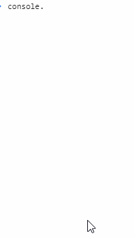
- console.log:普通信息
- console.info:提示类信息
- console.error:错误信息
- console.warn:警示信息

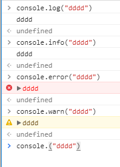

如果再配合console.group 与console.groupEnd，可以将这种分类管理的思想发挥到极致。这适合于在开发一个规模很大模块很多很复杂的Web APP时，将各自的log信息分组到以各自命名空间为名称的组里面。

```html
console.group("app.bundle");
console.warn("来自bundle模块的警告信息1");console.warn("来自bundle模块的警告信息2");
console.groupEnd();
console.group("app.bundle");
console.log("来自bundle模块的信息1");console.log("来自bundle模块的信息2");
console.groupEnd();
```
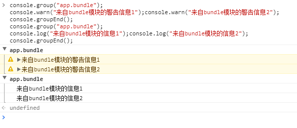

### 3.炫酷
另外，console.log家族还给我们提供了一个的API：第一个参数可以带一些格式化指令，比如%c,\n;看下面这个炫酷的效果：
```
  console.log('%chello world','font-size:25px;color:red;');
```
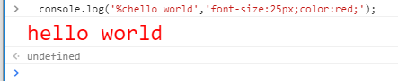
还可以加入更多的css样式
```
	
console.log('%chello world', 'background-image:-webkit-gradient( linear, left top, right top, color-stop(0, #f22), color-stop(0.15, #f2f), color-stop(0.3, #22f), color-stop(0.45, #2ff), color-stop(0.6, #2f2),color-stop(0.75, #2f2), color-stop(0.9, #ff2), color-stop(1, #f22) );color:transparent;-webkit-background-clip: text;font-size:5em;');
```
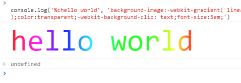

### 一个复杂的例子
```
var a = 0; console.log('%cscript Activated....', 'font-size:100px;color:#fff;text-shadow:0 1px 0#ccc,0 2px 0  #c9c9c9 ,0 3px 0  #bbb ,0 4px 0  #b9b9b9 ,0 5px 0  #aaa ,0 6px 1px rgba(0,0,0,.1),0 0 5px rgba(0,0,0,.1),0 1px 3px rgba(0,0,0,.3),0 3px 5px rgba(0,0,0,.2),0 5px 10px rgba(0,0,0,.25),0 10px 10px rgba(0,0,0,.2),0 20px 20px rgba(0,0,0,.15);'); setInterval(function () { var h = new Date(). getHours(); var m = new Date(). getMinutes(); var s = new Date(). getSeconds(); console.log(h + ":" + m + ":" + s); }, 1000); var i = setTimeout(function () {if (window.location.href.indexOf('') > -1) {alert('Please, When we to do autobuy, Do not refresh your browser or click any button until sale begins.we will get added to your cart automatically.');} else {alert('Invalid Page or Invalid URL');} a++; $(".jbv-buy-big, .jbv-reserve"). trigger("click"); if ((a % 5000) == 0) {console.log("Ticks: (x5000): " + a / 5000); }; if ($(".jbv-buy-big, .jbv-reserve").length > 0) {console.log("success!!!!"); } }, 1); console.log("Id: " + i); console.log("Tick count: " + a);
```
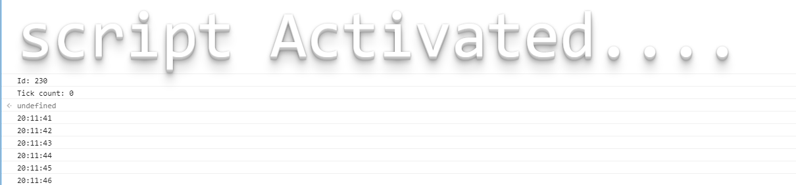

```
console.log("%cColorful CSS","background: rgba(252,234,187,1);background: -moz-linear-gradient(left, rgba(252,234,187,1) 0%, rgba(175,250,77,1) 12%, rgba(0,247,49,1) 28%, rgba(0,210,247,1) 39%,rgba(0,189,247,1) 51%, rgba(133,108,217,1) 64%, rgba(177,0,247,1) 78%, rgba(247,0,189,1) 87%, rgba(245,22,52,1) 100%);background: -webkit-gradient(left top, right top, color-stop(0%, rgba(252,234,187,1)), color-stop(12%, rgba(175,250,77,1)), color-stop(28%, rgba(0,247,49,1)), color-stop(39%, rgba(0,210,247,1)), color-stop(51%, rgba(0,189,247,1)), color-stop(64%, rgba(133,108,217,1)), color-stop(78%, rgba(177,0,247,1)), color-stop(87%, rgba(247,0,189,1)), color-stop(100%, rgba(245,22,52,1)));background: -webkit-linear-gradient(left, rgba(252,234,187,1) 0%, rgba(175,250,77,1) 12%, rgba(0,247,49,1) 28%, rgba(0,210,247,1) 39%, rgba(0,189,247,1) 51%, rgba(133,108,217,1) 64%, rgba(177,0,247,1) 78%, rgba(247,0,189,1) 87%, rgba(245,22,52,1) 100%);background: -o-linear-gradient(left, rgba(252,234,187,1) 0%, rgba(175,250,77,1) 12%, rgba(0,247,49,1) 28%, rgba(0,210,247,1) 39%, rgba(0,189,247,1) 51%, rgba(133,108,217,1) 64%, rgba(177,0,247,1) 78%, rgba(247,0,189,1) 87%, rgba(245,22,52,1) 100%);background: -ms-linear-gradient(left, rgba(252,234,187,1) 0%, rgba(175,250,77,1) 12%, rgba(0,247,49,1) 28%, rgba(0,210,247,1) 39%, rgba(0,189,247,1) 51%, rgba(133,108,217,1) 64%, rgba(177,0,247,1) 78%, rgba(247,0,189,1) 87%, rgba(245,22,52,1) 100%);background: linear-gradient(to right, rgba(252,234,187,1) 0%, rgba(175,250,77,1) 12%, rgba(0,247,49,1) 28%, rgba(0,210,247,1) 39%, rgba(0,189,247,1) 51%, rgba(133,108,217,1) 64%, rgba(177,0,247,1) 78%, rgba(247,0,189,1) 87%, rgba(245,22,52,1) 100%);filter: progid:DXImageTransform.Microsoft.gradient( startColorstr='#fceabb', endColorstr='#f51634', GradientType=1 );font-size:5em")
```
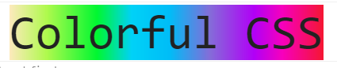
### 还可以是图片
比如这张

```
console.log("%c", "padding:100px 300px;line-height:250px;background:url('https://github.com/Gabrielkaliboy/images/blob/master/_posts/guideOfChromeConsole/1.gif?raw=true') no-repeat;");
```

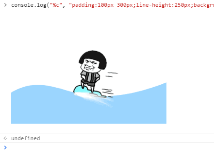

### 4.console.table可以让我们输出表格
```
var data = {code:200,content:[{'品名': '杜雷斯', '数量': 4}, {'品名': '冈本', '数量': 3}]};
console.table(data.content);
```
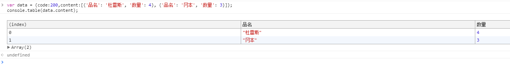
有的时候后端传回来一大串数据，是不是觉得直接console.log或是通过抓包工具查看都会让人晕头转向呢，这个时候正事console.table发挥作用的时候了，以表格的形式呈现数据，自然一目了然。


### 5.console.assert
当你想代码满足某些条件时才输出信息到控制台，那么你大可不必写if或者三元表达式来达到目的，cosole.assert便是这样场景下一种很好的工具，它会先对传入的表达式进行断言，只有表达式为假时才输出相应信息到控制台。
```
var isDebug=false;
console.assert(isDebug,'开发中的log信息。。。');
```
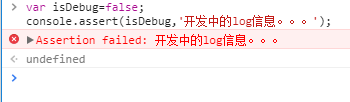

### 6.console.count
除了条件输出的场景，还有常见的场景是计数。当你想统计某段代码执行了多少次时也大可不必自己去写相关逻辑，内置的console.count可以很地胜任这样的任务。
```
function foo(){ 
    //其他函数逻辑blah blah。。。 
    console.count('foo 被执行的次数：');
}
foo();
foo();
foo();
```
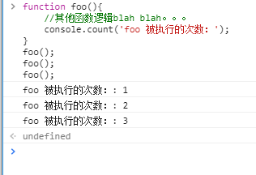


### 7.console.dir
将DOM结点以JavaScript对象的形式输出到控制台而console.log是直接将该DOM结点以DOM树的结构进行输出，与在元素审查时看到的结构是一致的。不同的展现形式，同样的优雅，各种体位任君选择反正就是方便与体贴。
```
  console.dir(document.body);
  console.log(document.body);
```
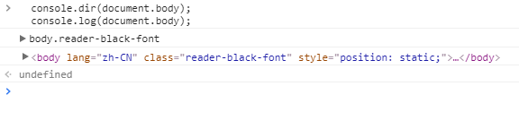


### 8.console.time & console.timeEnd
输出一些调试信息是控制台最常用的功能，当然，它的功能远不止于此。当做一些性能测试时，同样可以在这里很方便地进行。比如需要考量一段代码执行的耗时情况时，可以用console.time与console.timeEnd来做此事。
这里借用官方文档的例子：
```
console.time("Array耗时");
var array= new Array(10000000);
for (var i = array.length - 1; i >= 0; i--) {
    array[i] = new Object();
};
console.timeEnd("Array耗时");
```
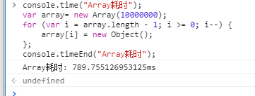


当然，我们也可以选择自己写代码来计时：
```javascript
var start=new Date().getTime();
var array= new Array(1000000);
for (var i = array.length - 1; i >= 0; i--) {
     array[i] = new Object();
};
console.log(new Date().getTime()-start);
```
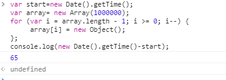

通过调用内置的console.time
得到的结果要比自己手动计算的时间差更精确可靠。

### 9.console.profile & console.timeLime
当想要查看CPU使用相关的信息时，可以使用console.profile配合 console.profileEnd来完成这个需求。这一功能可以通过UI界面来完成，Chrome 开发者工具里面有个tab便是Profile。与此类似的功能还有console.timeLine配合 console.timeLineEnd,它的作用是开始记录一段时间轴，同样可以通过Chrome开发者工具里的Timeline 标签来进行相应操作。所以在我看来这两个方法有点鸡肋，因为都可以通过操作界面来完成。但至少他提供了一种命令行方式的交互，还是多了种姿势供选择吧。

### $
```
$0~$4
```
则代表了最近5个你选择过的DOM节点。
什么意思呢？在页面右击选择审查元素，然后在弹出来的DOM结点树上面随便点选，这些被点过的节点会被记录下来，而1返回的是上上次点选的DOM节点，最多保存了5个，如果不够5个，则返回undefined。

另外值得一赞的是，Chrome 控制台中原生支持类jQuery的选择器，也就是说你可以用$加上熟悉的css选择器来选择DOM节点

```
$('body');
$$('div');
```

(selector)是原生JavaScript document.querySelector() 的封装。
同时另一个命令$$(selector)返回的是所有满足选择条件的元素的一个集合，是对document.querySelectorAll() 的封装。

### $x(path)
将所匹配的节点放在一个数组里返回
```
$x("//p");
$x("//p[a]");
```
x(“//p[a]”);匹配所有子节点包含a的p节点
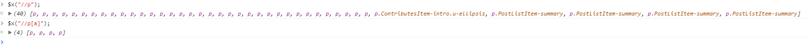

### copy
```
	
copy(document.body)

```
然后你就可以Ctrl+v了。
注意：他不依附于任何全局变量比如window，所以其实在JS代码里是访问不了这个copy方法的，所以从代码层面来调用复制功能也就无从谈起。但愿有天浏览器会提供相应的JS实现吧~这样我们就可以通过js代码进行复制操作而不用再依赖Flash插件了。


### keys & values
这是一对基友。前者返回传入对象所有属性名组成的数据，后者返回所有属性值组成的数组。具体请看下面的例子：
```
var tfboy={name:'wayou',gender:'unknown',hobby:'opposite to the gender'};
keys(tfboy);
values(tfboy);
```
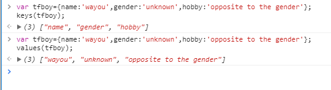

### monitor & unmonitor
monitor(function)，它接收一个函数名作为参数，比如function a,每次a被执行了，都会在控制台输出一条信息，里面包含了函数的名称a及执行时所传入的参数。而unmonitor(function)便是用来停止这一监听。
```
function sayHello(name){
    alert('hello,'+name);
}
monitor(sayHello);
sayHello('damonare');
sayHello('tjz');
unmonitor(sayHello);

```

### debug & undebug
debug同样也是接收一个函数名作为参数。当该函数执行时自动断下来以供调试，类似于在该函数的入口处打了个断点，可以通过debugger来做到，同时也可以通过在Chrome开发者工具里找到相应源码然后手动打断点。而undebug 则是解除该断点。而其他还有好些命令则让人没有说的欲望，因为好些都可以通过Chrome开发者工具的UI界面来操作并且比用在控制台输入要方便。