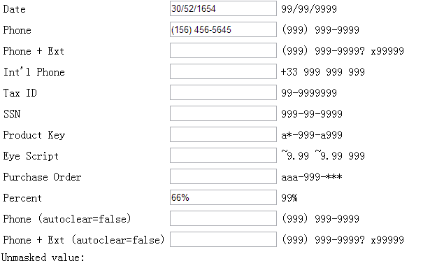
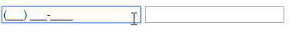
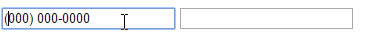
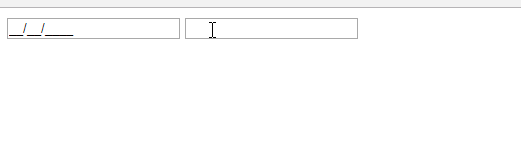
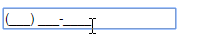
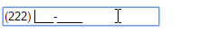
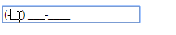
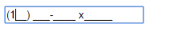
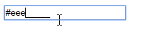

<Excerpt in index | 首页摘要> 
maskedinput使用说明
<!-- more -->
<The rest of contents | 余下全文>

-----
#### 1. 介绍
GitHub：https://github.com/digitalBush/jquery.maskedinput
官网：http://digitalbush.com/projects/masked-input-plugin/



**masked-input**是一个字符输入格式化的jQuery插件。它可让你轻松的实现对各种数据的输入进行格式限制，如日期、电话等。masked-input在ie,Firefox,Safari和Chrome通过测试。mask会自动为用户输入类型占位符且用户将不能删除。以下为占位符的代表意义。
- a代表一个字符（A-Z，a-z）

- 9代表一个数字字符（0-9）

- *代表一个字母（A-Z，a-z，0-9）

如果预定义的占位符不合适你的要求，你可以进行自定义格式。例如，你需要定义一个只允许十六进制字符的格式，命名为H，你只需这样定义$.mask.definitions['h'] = "[A-Fa-f0-9]"就可以了，这样你就可以限制输入的格式为#hhhhhh。

#### 2. 使用方法
效果图

- 引入jQuery和maskedinput.js文件
```javascript
    <script src="https://cdn.bootcss.com/jquery/1.10.2/jquery.js"></script>
    <script src="https://cdn.bootcss.com/jquery.maskedinput/1.4.0/jquery.maskedinput.min.js"></script>
```
- HTML结构
```html
    <input id="phone" type="text" tabindex="1" />
    <input id="date" value="1231" type="text" tabindex="2" />
```
- 给要格式化的input加上masked
```javascript
    $(function() {
         $("#date").mask("99/99/9999");
         $("#phone").mask("(999) 999-9999");
     });
```
整体的一个代码
```html
<!DOCTYPE html>
<html lang="en">
<head>
    <meta charset="UTF-8">
    <script src="https://cdn.bootcss.com/jquery/1.10.2/jquery.js"></script>
    <script src="https://cdn.bootcss.com/jquery.maskedinput/1.4.0/jquery.maskedinput.min.js"></script>
    <title></title>
</head>
<body>
    <input id="phone" type="text" tabindex="1"/>
    <input id="date"  type="text" tabindex="2" />
</body>
<script type="text/javascript">
    $(function() {
        $("#phone").mask("(999) 999-9999");
        $("#date").mask("99/99/9999");
    });
</script>
</html>
```

#### 3.修改占位符，默认的占位符号为下划线"_",我们分别修改为用0占位，用*占位

代码
```html
<!DOCTYPE html>
<html lang="en">
<head>
    <meta charset="UTF-8">
    <script src="https://cdn.bootcss.com/jquery/1.10.2/jquery.js"></script>
    <script src="https://cdn.bootcss.com/jquery.maskedinput/1.4.0/jquery.maskedinput.min.js"></script>
    <title></title>
</head>
<body>
    <input id="phone" placeholder="请输入手机号码" type="text" tabindex="1"/>
    <input id="date"  type="text" tabindex="2" />
</body>
<script type="text/javascript">
    $(function() {
        //我们将默认的下划线去掉了，用0占位
        $("#phone").mask("(999) 999-9999",{placeholder:"0"});
        //用*占位
        $("#date").mask("99/99/9999",{placeholder:"*"});
    });
</script>
</html>
```

#### 4. 当文本框输入完毕以后，触发一个函数

代码：
```html
<!DOCTYPE html>
<html lang="en">
<head>
    <meta charset="UTF-8">
    <script src="https://cdn.bootcss.com/jquery/1.10.2/jquery.js"></script>
    <script src="https://cdn.bootcss.com/jquery.maskedinput/1.3.1/jquery.maskedinput.min.js"></script>
    <title></title>
</head>
<body>
    <input id="phone" placeholder="请输入手机号码" type="text" tabindex="1"/>
    <input id="date"  type="text" tabindex="2" />
</body>
<script type="text/javascript">
    $(function() {
        //用户输入完毕以后调用一个函数
        $("#phone").mask("99/99/9999",{completed:function(){alert("你输入的手机号是: "+this.val());}});
        //用*占位
        $("#date").mask("99/99/9999",{placeholder:"*"});
    });
</script>
</html>
```
#### 5. 当文本框输入不完整的时候，不自动清空输入内容
！！！这个功能在1.3.1版本不支持，1.4.0可以
默认情况下，autoclear:true，所以当输入不全时候，会清空输入框，只有全部输入才不会清空，如下图


我们将autoclear:false，以后，输入不完整也不会清空输入框


代码：
```html
<!DOCTYPE html>
<html lang="en">
<head>
    <meta charset="UTF-8">
    <script src="http://libs.baidu.com/jquery/1.9.1/jquery.min.js"></script>
    <script src="https://cdn.bootcss.com/jquery.maskedinput/1.4.0/jquery.maskedinput.min.js"></script>
    <title></title>
</head>
<body>
    <input id="phone" type="text" tabindex="6" />
</body>
<script type="text/javascript">
    $(function() {
        //
        $("#phone").mask("(999) 999-9999" , { autoclear: false });
    })
</script>
</html>
```
#### 6. 你可以设置自己的代替规则
我定义了符号"~"代表"+"或者"-"号，下面这个例子，第一个字符只能输入+或者-

代码：
```html
<!DOCTYPE html>
<html lang="en">
<head>
    <meta charset="UTF-8">
    <script src="http://libs.baidu.com/jquery/1.9.1/jquery.min.js"></script>
    <script src="https://cdn.bootcss.com/jquery.maskedinput/1.4.0/jquery.maskedinput.min.js"></script>
    <title></title>
</head>
<body>
    <input id="phone" type="text" tabindex="6" />
</body>
<script type="text/javascript">
    $(function() {
        //自定义规则“~”符号代替“+”或者“-”
        $.mask.definitions['~']='[+-]';
        //这样，用户在输入的时候，第一位必须为加号，或者减号
        $("#phone").mask("(~99) 999-9999");
    })
</script>
</html>
```

#### 7. 使用特殊符号"?",实现部分使用masked
？后面的输入内容可有可无

代码：
```
<!DOCTYPE html>
<html lang="en">
<head>
    <meta charset="UTF-8">
    <script src="http://libs.baidu.com/jquery/1.9.1/jquery.min.js"></script>
    <script src="https://cdn.bootcss.com/jquery.maskedinput/1.4.0/jquery.maskedinput.min.js"></script>
    <title></title>
</head>
<body>
    <input id="phone" type="text" tabindex="6" />
</body>
<script type="text/javascript">
    $(function() {
        $("#phone").mask("(999) 999-9999? x99999", { autoclear: false });
    })
</script>
</html>
```

#### 8. 系统本书自带的占位符不满足你的需求，比如我们想限制输入16进制，我们就可以自己定制一个。
关键代码：`$.mask.definitions['h'] = "[A-Fa-f0-9]";`

代码：
```html
<!DOCTYPE html>
<html lang="en">
<head>
    <meta charset="UTF-8">
    <script src="http://libs.baidu.com/jquery/1.9.1/jquery.min.js"></script>
    <script src="https://cdn.bootcss.com/jquery.maskedinput/1.4.0/jquery.maskedinput.min.js"></script>
    <title></title>
</head>
<body>
    <input id="test" type="text" tabindex="6" />
</body>
<script type="text/javascript">
    $(function() {
    	//设置h的输入范围只能是数字0-9，字母A-F,a-f
    	$.mask.definitions['h'] = "[A-Fa-f0-9]";
    	//限制输入8位16进制数字
        $("#test").mask("#hhhhhhhh");
    })
</script>
</html>
```