<Excerpt in index | 首页摘要> 
你不知道的电脑黑科技，可以大大提高你的工作效率
<!-- more -->
<The rest of contents | 余下全文>

-----

文章大部分总结于虫部落：http://bbs.chongbuluo.com/forum.php?mod=viewthread&tid=366
#### 1. 启动命令行：win+R,输入cmd 
#### 2. 在文件上面直接运行命令行
在当前文件目录下，空白处，按着shift键右击，会出现在此处打开命令窗口
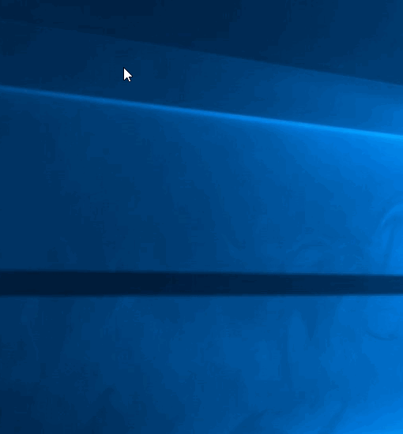

#### 3. 复制文件的路径，在要复制的文件上单击选中，然后按住shift键的同时右击，这时候在右击选择菜单中会出现复制为路径
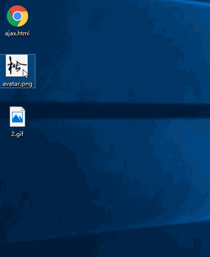
#### 4. 如何不通过加密软件对我们的文件进行加密
##### 4.1新建一个test文件夹，名字随意，在这个文件夹新建一个文本文档，比如lock,如图

    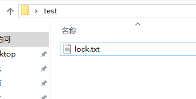
##### 4.2用编辑器打开lock.txt文本文档，里面写入如下代码
```shell
cls
@ECHO OFF
title Folder Private
if EXIST "HTG Locker" goto UNLOCK
if NOT EXIST Private goto MDLOCKER
:CONFIRM
echo 你确定要加密隐藏Private文件夹吗？(Y/N)
set/p "cho=>"
if %cho%==Y goto LOCK
if %cho%==y goto LOCK
if %cho%==n goto END
if %cho%==N goto END
echo Invalid choice.
goto CONFIRM
:LOCK
ren Private "HTG Locker"
attrib +h +s "HTG Locker"
echo Folder locked
goto End
:UNLOCK
echo 输入密码来解锁文件夹
set/p "pass=>"
if NOT %pass%== 在此设置密码 goto FAIL
attrib -h -s "HTG Locker"
ren "HTG Locker" Private
echo Folder Unlocked successfully
goto End
:FAIL
echo Invalid password
goto end
:MDLOCKER
md Private
echo Private created successfully
goto End
:End
```

写好以后如下

```
cls
@ECHO OFF
title Folder Private
if EXIST "HTG Locker" goto UNLOCK
if NOT EXIST Private goto MDLOCKER
:CONFIRM
echo 你确定要加密隐藏Private文件夹吗？(Y/N)
set/p "cho=>"
if %cho%==Y goto LOCK
if %cho%==y goto LOCK
if %cho%==n goto END
if %cho%==N goto END
echo Invalid choice.
goto CONFIRM
:LOCK
ren Private "HTG Locker"
attrib +h +s "HTG Locker"
echo Folder locked
goto End
:UNLOCK
echo 输入密码来解锁文件夹
set/p "pass=>"
if NOT %pass%== 456123 goto FAIL
attrib -h -s "HTG Locker"
ren "HTG Locker" Private
echo Folder Unlocked successfully
goto End
:FAIL
echo Invalid password
goto end
:MDLOCKER
md Private
echo Private created successfully
goto End
:End
```

##### 4.3然后将lock.txt改为lock.bat,注意后缀发生了变化。之后双击lock.bat，他会自动在lock.bat所在的目录生成一个Private目录，如图

    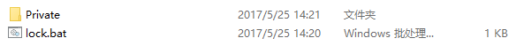

##### 4.4将我们要加密的文件扔进Private文件就可以了，然后再次点击lock.bat,这时会弹出cmd命令让你确认，如图我们输入Y
	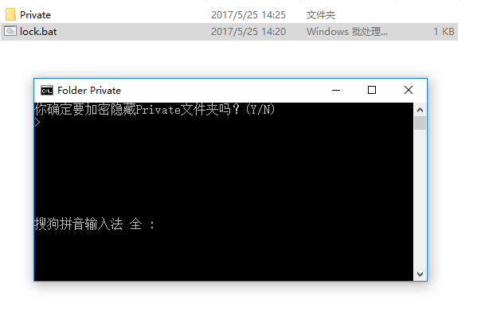

##### 4.5输入Y以后Private目录直接就被隐藏了，然后我们再次双击lock.bat,他会要求我们输入密码，我们输入我们上面设置的密码，回车以后如果密码正确，Private文件就又出来了

	

如果你将文件转移，记得lock.bat与Private目录一起


#### 5. 直接查看文件的属性
按住Alt键，然后鼠标双击左键
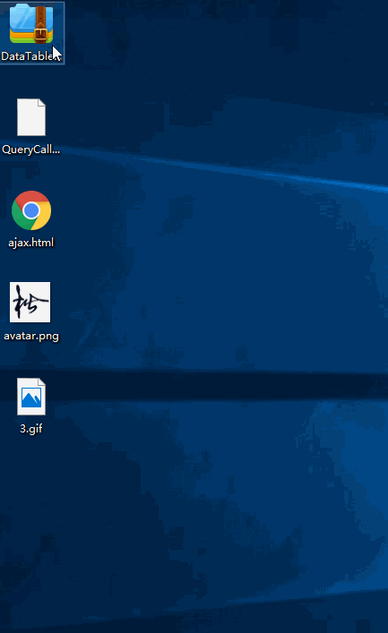

#### 6. 在文档文档里面输入.LOG，然后他们次都会记录我们修改的时间，如图所示
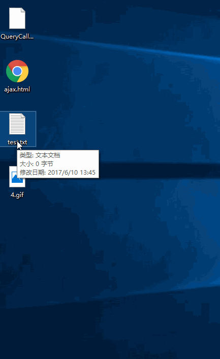

#### 7. 使用Windows自带的字符映射表来输入一些特殊字符，Win+R，输入"charmap"就可以调出他，如图所示
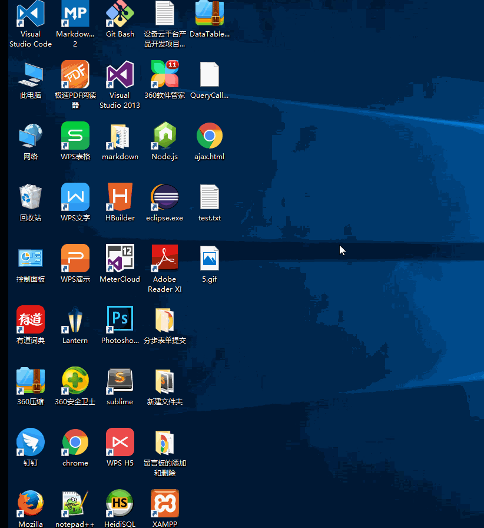

#### 8.“Win键+数字键（0~9）”可以快速启动锁定在任务栏中的前10个对应的程序。如按“Win键+3”即可启动网易云音乐了


#### 9. 将经常访问的文件夹拖到快速访问里面，这样就不必生成快捷方式，还可以很快的在文件夹快速导航
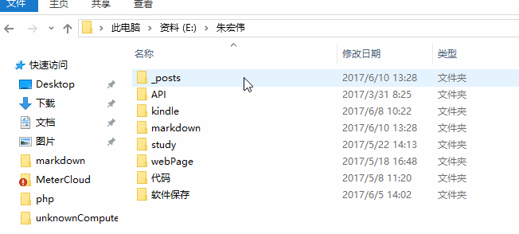
在已经打开的文件夹窗口下右击鼠标，就会弹出快速导航窗口
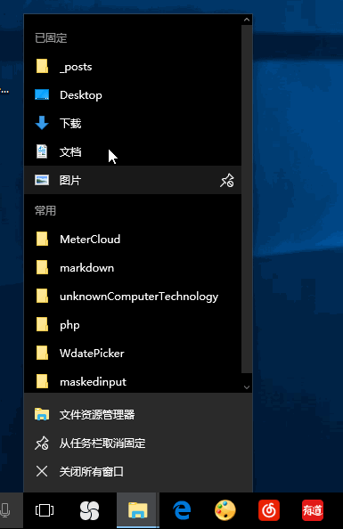
当然，如果你想删除在快速导航里面的文件夹，只需要在第一步反过来就好

#### 10. 窗口调整
“Win键+方向键”
“Win键+↑” 最大化
“Win键+↓” 最小化
“Win键+←” 窗口占左半边屏幕，“Win键+→”相反。

#### 11. 重命名文件
- 单击选中(左击),再单击就可以修改文件名字了
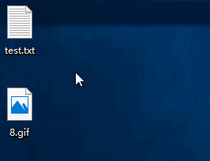

- 单击选中（右击），然后按F2键，也可以快速修改名字

#### 12. 重命名文件（这个真的很屌）
将要批量修改的名称的文件全部选中，然后按F2键(不用快捷键也可以，但是有点麻烦，你得按着Ctrl，然后右击一个文件，选择重命名，他麻烦了)
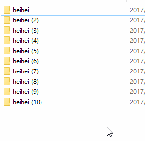

#### 13.如果不小心把网页关了，你知道怎么找回来吗？记得，只要按 "Ctrl+Shift+T"，就能立即开启刚刚关上的页面！chrome，firefox，ie都支持
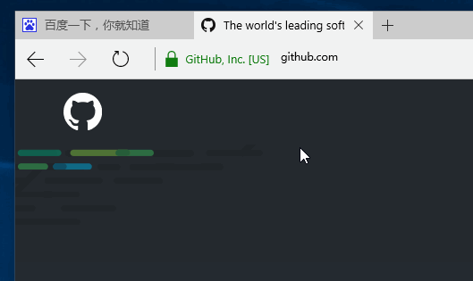

#### 14.给某个应用添加快捷键启动
我给picpick添加一个快捷键启动，比如Ctrl+Alt+向上的箭头，记得改完以后一定要点击应用按钮
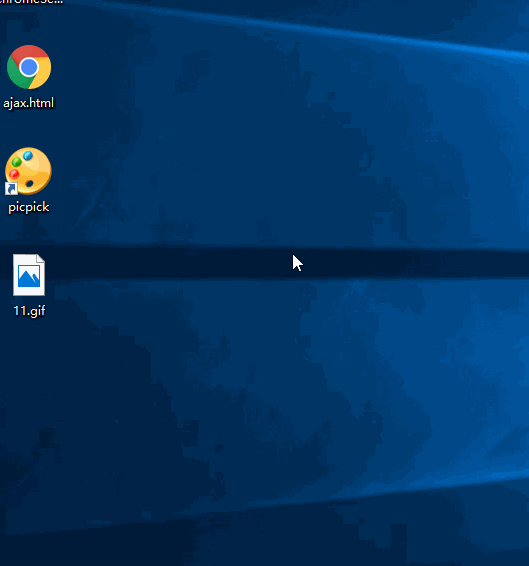

#### 15.F5在文本文档一键嵌入当前日期和时间
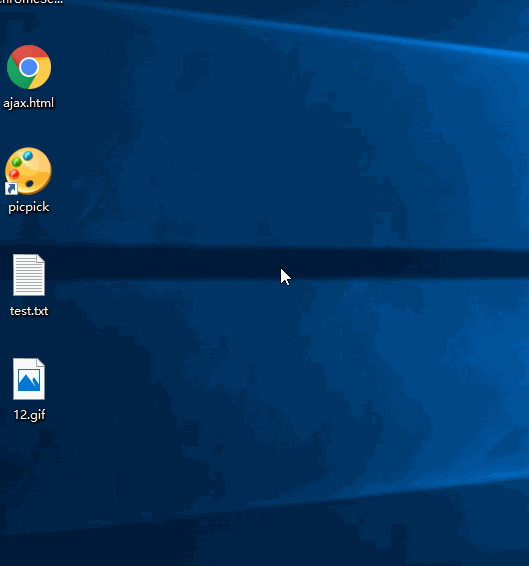

#### 16.win+home
如果你屏幕上有很多窗口都最大化了，虽然你只能看到当前的程序，但是被挡在后面最大化的窗口也会占用很多系统资源，这时候如果你按下Win+Home，就可以将除当前窗口外其他所有程序都最小化，节约系统资源快速有效（Win7也适用唷~）

#### 17.F5在文本文档一键嵌入当前日期和时间

#### 18.建一个文本文件然后输入shutdown -s -t 60 保存，把文本文件的txt格式改为bat，-t 后面的参数表示要延迟多少秒。运行脚本后60秒关机。win-r, cmd, shutdown -a取消关机

#### 19.CTRL + Z不仅可以撤销被删除的文字，还可以快速恢复被删除的文件（ps:shift+del删除的不能恢复）
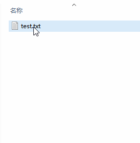

#### 20.win10中，多窗口时，按住一个窗口，然后摇动几下，其余窗口会最小化，在继续摇动，会恢复。
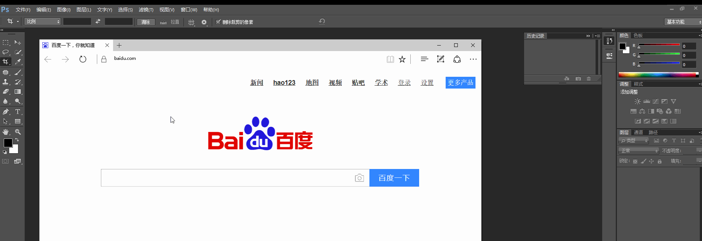

#### 21.在world文档里，ctrl和加号键组合可以把文字转换为下标输入


#### 22.在任务栏实现滑动关机功能。
路径C:\Windows\System32，找到SlideToShutDown.exe，右键发送到桌面快捷方式，打开属性，设置下文件名和图标，最后拖到任务栏固定，再关机的时候直接双击就可以了

#### 23.打开window自带的画图。
window+R打开cmd，输入mspaint

#### 24.空白桌面右键-查看-显示桌面图标前的勾去掉，就会显示一个只有背景图片的桌面。同样空白任务栏右键-属性-自动隐藏任务栏前打勾(win10右击任务栏-->设置--->在桌面模式下自动隐藏任务栏)，将任务栏也隐藏掉。这两样做下来，桌面就只剩下纯的背景图片了。

#### 25.上班时间有很很很重要的一个比赛进行到关键时候了，很想看画面肿么办？

浏览器打开视频页面，然后将其隐藏到当前窗口后面。光标再移动到任务栏浏览器那里就可以在 mini 窗口中看比赛了~

#### 26. 按住Print Screen键可以快速截取全屏，但是需要放在画板或者QQ软件里面粘贴一下才能用

#### 27.win10自带的截图软件
win+R ，输入snippingtool,就打开了

#### 28.2345好压 可以右键批量修改文件名  前后任意添加/删除/替换
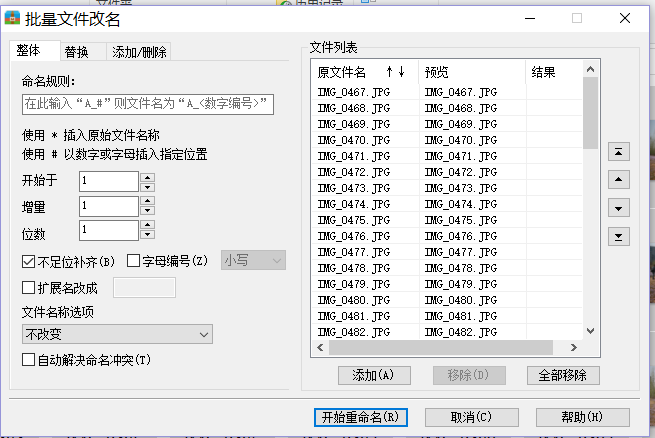

#### 29.相当于鼠标右键的按键,按这个按键就和鼠标右击是一样的，或者直接按快捷键shift+F10
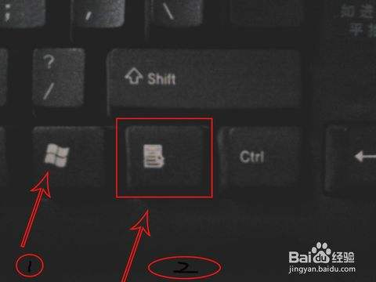

这里我想实现隐藏桌面所有图标，然后在需要的时候在把图标显示出来，（为了装逼），但是鼠标单击太麻烦了，那我们就直接用快捷键
键盘鼠标右键+V+D

#### 30.win10设置里可以设置按这三个键有提示音Caps Lock（大小写锁定键）Num Lock（数字键盘的开关键）Scroll Lock（滚动锁定键）
开始-->设置--->轻松使用--->键盘
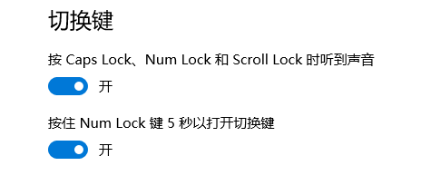


#### Windows快捷键部分
官网给出的说明：https://support.microsoft.com/zh-cn/help/12445/windows-keyboard-shortcuts#keyboard-shortcuts=windows-8
- Ctrl+shift+N:快速新建文件夹
- Ctrl+shift+Esc:任务管理器
- Windows+D桌面与当前窗口来回切换
- Windows+M直接切回桌面（不能再切回来）
- windows+E打开我的电脑

- Windows+T,在桌面任务栏来回切换


- Windows+B将操作区域移动到右下角的系统托盘，可以在没有鼠标的时候救急一下
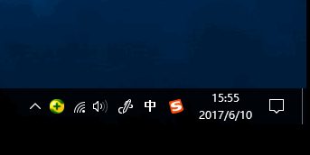

