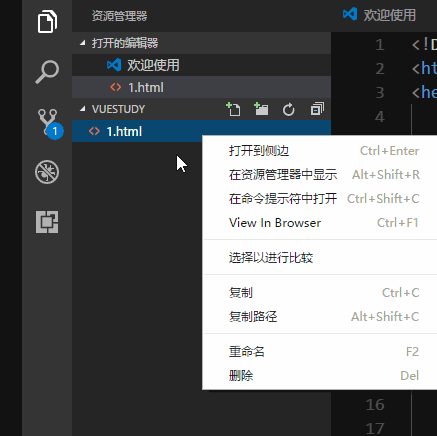
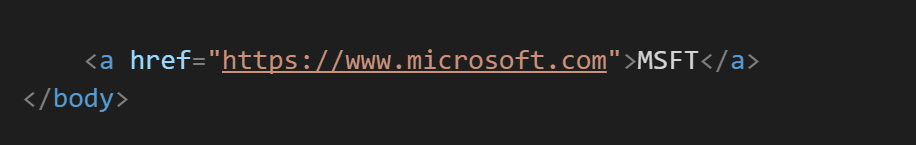

---
title:vs code使用相关记录
date: 2017-06-19 09:09:40
categories: 软件
tags: [前端,javascript,vue]
---
<Excerpt in index | 首页摘要> 
vsCode
<!-- more -->
<The rest of contents | 余下全文>

-----

### 插件
---
在vs里面使用快捷键Ctrl+p来安装插件

#### 1.View In Browser
用来在vs code里面预览html文件，默认的快捷键Ctrl+F1
注：只支持html文件

#### Open in Browser
也是用来在浏览器中事先预览的

#### 2.Auto Rename Tag
修改html标签，自动帮你完成尾部闭合标签的同步修改

#### 3.Auto close Tag
自动闭合标签

#### 4.Path intellisense
用来路径提示的

####  5.vue的插件vetur
可以轻松在.vue文件里面
- 语法错误检查，包括 CSS/SCSS/LESS/Javascript/TypeScript
- 语法高亮，包括 html/jade/pug css/sass/scss/less/stylus js/ts
- emmet 支持
- 代码自动补全（目前还是初级阶段），包括 HTML/CSS/SCSS/LESS/JavaScript/TypeScript