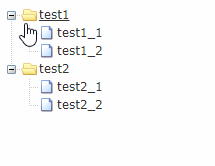

<Excerpt in index | 首页摘要> 
zTree记录
<!-- more -->
<The rest of contents | 余下全文>

-----

#### 1.说明
官网：http://www.treejs.cn/v3/main.php#_zTreeInfo

GitHub：https://github.com/zTree/zTree_v3

作者的一个教程：https://note.wiz.cn/pages/manage/biz/payRead.html?kb=3fe9d146-6498-4882-b75c-f533442aba5b

API文档：http://www.treejs.cn/v3/api.php

介绍：zTree 是一个依靠 jQuery 实现的多功能 “树插件”。优异的性能、灵活的配置、多种功能的组合是 zTree 最大优点

简单demo演示:http://www.treejs.cn/v3/demo.php#_101

#### 2.使用
需要同时引入
```html
  <link rel="stylesheet" href="css/zTreeStyle/zTreeStyle.css" type="text/css">
  <script src="https://cdn.bootcss.com/jquery/1.10.2/jquery.js"></script>
  <script type="text/javascript" src="js/jquery.ztree.all.min.js"></script>
```

一个简单的例子
```html
<!DOCTYPE html>
<HTML>
 <HEAD>
  <TITLE> ZTREE DEMO </TITLE>
  <meta http-equiv="content-type" content="text/html; charset=UTF-8">
  <link rel="stylesheet" href="css/zTreeStyle/zTreeStyle.css" type="text/css">
  <script src="https://cdn.bootcss.com/jquery/1.10.2/jquery.js"></script>
  <script type="text/javascript" src="js/jquery.ztree.all.min.js"></script>
  <script type="text/javascript">
    var zTreeObj;
    // zTree 的参数配置，深入使用请参考 API 文档（setting 配置详解）
    var setting = {};
    // zTree 的数据属性，深入使用请参考 API 文档（zTreeNode 节点数据详解）
    var zNodes = [
    {name:"test1", open:true, children:[
       {name:"test1_1"}, {name:"test1_2"}]},
    {name:"test2", open:true, children:[
       {name:"test2_1"}, {name:"test2_2"}]}
    ];
    //初始化
    $(document).ready(function(){
       zTreeObj = $.fn.zTree.init($("#treeDemo"), setting, zNodes);
    });
  </script>
 </HEAD>
<BODY>
<div>
   <ul id="treeDemo" class="ztree"></ul>
</div>
</BODY>
</HTML>
```


#### 3.实际项目中的一个应用

使用ajax请求，动态添加dom树结构，替换了默认图标
html
```html
<!DOCTYPE html>
<html lang="en">
<head>
	<meta charset="UTF-8">
	<link rel="stylesheet" href="css/zTreeStyle/zTreeStyle.css" type="text/css">
	<script src="https://cdn.bootcss.com/jquery/1.10.2/jquery.js"></script>
	<script type="text/javascript" src="js/jquery.ztree.all.min.js"></script>
	<title></title>
</head>
<body>
	<div>
	   <ul class="ztree" id="modeltree"></ul>
	</div>
</body>
<script>
	document.ready=function(){
		var setting = {
		    view: { showLine: false }, 
		    data: { simpleData: { enable: true } },
		};
		function inittree() {
		    $.ajax({
		        timeout: 3000,
		        type: "GET",
		        url: "2.json",
		        success: showtree
		    });
		};
		function showtree(json) {
		    $.fn.zTree.init($("#modeltree"), setting, json);
		}
		inittree();
	};
</script>
</html>
```
json
```json
[
    {
        "id": "1000",
        "pId": "0",
        "name": "光谱亮度计",
        "boolmodel": false,
        "icon": "",
        "open": true
    },
    {
        "id": "1001",
        "pId": "1000",
        "name": "SRC-200S",
        "boolmodel": true,
        "icon": "images/items_16.png",
        "open": true
    },
    {
        "id": "1002",
        "pId": "1000",
        "name": "SRC-200M",
        "boolmodel": true,
        "icon": "images/items_16.png",
        "open": true
    },
    {
        "id": "1003",
        "pId": "1000",
        "name": "SRC-600S",
        "boolmodel": true,
        "icon": "images/items_16.png",
        "open": true
    },
    {
        "id": "1004",
        "pId": "1000",
        "name": "SRC-600M",
        "boolmodel": true,
        "icon": "images/items_16.png",
        "open": true
    },
    {
        "id": "1005",
        "pId": "1000",
        "name": "SRC-600MX",
        "boolmodel": true,
        "icon": "images/items_16.png",
        "open": true
    },
    {
        "id": "1006",
        "pId": "1000",
        "name": "SRC-600",
        "boolmodel": true,
        "icon": "images/items_16.png",
        "open": true
    },
    {
        "id": "1100",
        "pId": "0",
        "name": "光谱仪",
        "boolmodel": false,
        "icon": "",
        "open": true
    },
    {
        "id": "1101",
        "pId": "1100",
        "name": "HAAS-2000",
        "boolmodel": true,
        "icon": "images/items_16.png",
        "open": true
    },
    {
        "id": "1102",
        "pId": "1100",
        "name": "HAAS-1200",
        "boolmodel": true,
        "icon": "images/items_16.png",
        "open": true
    },
    {
        "id": "1103",
        "pId": "1100",
        "name": "CAS-200",
        "boolmodel": true,
        "icon": "images/items_16.png",
        "open": true
    },
    {
        "id": "1200",
        "pId": "0",
        "name": "分布式光度计",
        "boolmodel": false,
        "icon": "",
        "open": true
    },
    {
        "id": "1201",
        "pId": "1200",
        "name": "GO-2000",
        "boolmodel": true,
        "icon": "images/items_16.png",
        "open": true
    },
    {
        "id": "1202",
        "pId": "1200",
        "name": "GO-R5000",
        "boolmodel": true,
        "icon": "images/items_16.png",
        "open": true
    },
    {
        "id": "1203",
        "pId": "1200",
        "name": "GO-NR1000",
        "boolmodel": true,
        "icon": "images/items_16.png",
        "open": true
    },
    {
        "id": "1300",
        "pId": "0",
        "name": "照度计",
        "boolmodel": false,
        "icon": "",
        "open": true
    },
    {
        "id": "1301",
        "pId": "1300",
        "name": "SPIC-200",
        "boolmodel": true,
        "icon": "images/items_16.png",
        "open": true
    },
    {
        "id": "0",
        "pId": "-1",
        "name": "全部",
        "boolmodel": false,
        "icon": "images/home_16.png",
        "open": true
    }
]
```